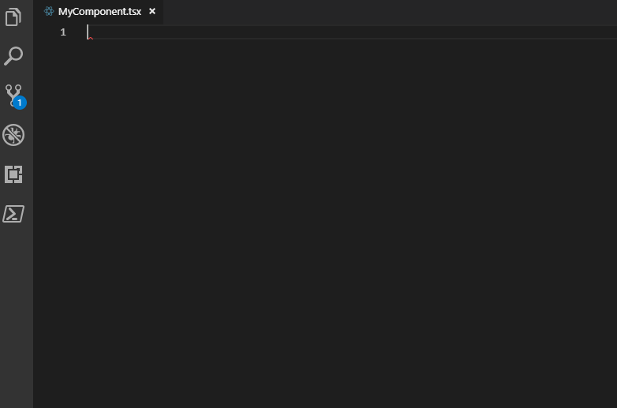

# React-Faster

React snippets for TypeScript done right.

Many people are not good in memorizing magic acronims like `rcc`, `imr`, and similar.

So many books on coding stress on importance of readable names. So, it's okay to spell out snippets' prefixes:

## List of Snippets

| Prefix (name)                            | Snipper result                                    |
|------------------------------------------|---------------------------------------------------|
| `react-component-functional`             | React functional component.                       |
| `react-component-class-stateteless`      | React class component without state. |
| `react-component-class-stateteful`       | React class component with state. |
| `react-mobx-component-functional`        | mobx-enabled React functional component.          |
| `react-mobx-component-class-stateteless` | mobx-enabled React class component without state. |
| `react-mobx-component-class-stateteful`  | mobx-enabled React class component with state.    |
